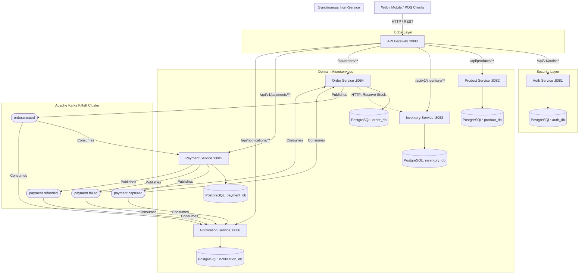
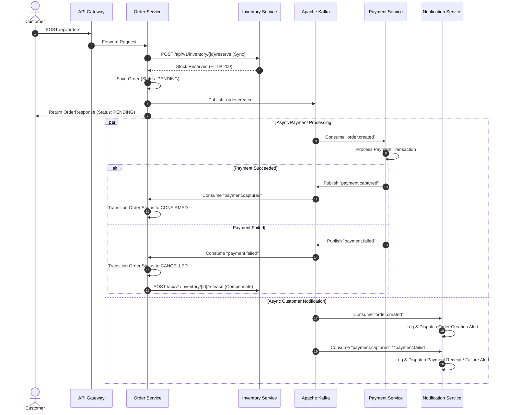

# Omnichannel Order Processing Platform

[](https://openjdk.org/projects/jdk/21/)
[](https://spring.io/projects/spring-boot)
[-black.svg?logo=apachekafka&logoColor=white)](https://kafka.apache.org/)
[](https://www.postgresql.org/)
[](https://www.docker.com/)
[](docs/AWS_COPILOT_ECS_DEPLOYMENT.md)
[](docs/AWS_COPILOT_ECS_DEPLOYMENT.md)
[](.github/workflows/ci-cd.yml)
[](docs/AWS_CICD_SETUP.md)
[](LICENSE)

An enterprise-grade, distributed **Omnichannel Order Processing Platform** built with **Java 21**, **Spring Boot**, **Spring Cloud Gateway**, and **Apache Kafka**. Designed for high availability, fault tolerance, and eventual consistency across physical retail and digital storefront channels.

---

## Table of Contents

- [Architectural Highlights](#architectural-highlights)
- [System Architecture](#system-architecture)
- [Microservice Ecosystem](#microservice-ecosystem)
- [Event-Driven Saga Pattern (Order Lifecycle)](#event-driven-saga-pattern-order-lifecycle)
- [API Gateway Routing & Endpoints](#api-gateway-routing--endpoints)
- [Security & RBAC](#security--rbac)
- [Technology Stack](#technology-stack)
- [Getting Started](#getting-started)
  - [Prerequisites](#prerequisites)
  - [Starting Infrastructure with Docker Compose](#starting-infrastructure-with-docker-compose)
  - [Running Microservices Locally](#running-microservices-locally)
- [Testing](#testing)
- [CI/CD & Cloud Deployment](#cicd--cloud-deployment)
- [Repository Structure](#repository-structure)
- [Observability & Health Checks](#observability--health-checks)
- [License](#license)

---

## Architectural Highlights

- **Microservices Architecture**: Decoupled domain boundaries with independent build lifecycles and dedicated persistence layers (Database-per-Service pattern).
- **Choreographed Event-Driven Saga**: Asynchronous distributed transaction management using **Apache Kafka** to maintain eventual consistency without distributed locking bottlenecks.
- **Unified Edge Routing**: **Spring Cloud Gateway (WebFlux)** serving as the non-blocking API Gateway reverse proxy for unified traffic routing, CORS policies, and rate-limiting readiness.
- **Enterprise Security**: Zero-trust authentication via stateless **JWT tokens**, BCrypt password hashing, and granular **Role-Based Access Control (RBAC)**.
- **Lean, Hardened Production Containers**: Built on `eclipse-temurin:21-jre-alpine` (~95MB image footprint), running with least-privilege `appuser` non-root security and JVM container ergonomics (`-XX:+UseContainerSupport -XX:MaxRAMPercentage=75.0`) to eliminate container OOM kills.
- **Reliable Data Migrations**: Automated, version-controlled relational schema migrations using **Flyway**.
- **Hermetic Integration Testing**: 100% self-contained test suites powered by **Spring Boot Testcontainers** (ephemeral PostgreSQL 17 and Apache Kafka Native) requiring zero pre-running host dependencies in CI.
- **Secure Cloud Native CI/CD**: Automated GitHub Actions pipelines featuring parallel test matrices, automated dependency container builds, and **keyless AWS OIDC authentication** to Amazon ECR and Amazon ECS Fargate.

---

## System Architecture



---

## Microservice Ecosystem

| Service | Port | Database / Schema | Responsibilities |
| :--- | :--- | :--- | :--- |
| **API Gateway** | `8080` | *None* | Central reverse proxy, request routing, WebFlux non-blocking load handling. |
| **Auth Service** | `8081` | `auth_db` | User registration, authentication, JWT generation/validation, role authorization. |
| **Product Service** | `8082` | `product_db` (`product_schema`) | Product catalog lifecycle (CRUD), pricing, categories, and metadata. |
| **Inventory Service** | `8083` | `inventory_db` (`inventory_schema`) | Multi-channel stock management, stock reservations, releases, and stock audits. |
| **Order Service** | `8084` | `order_db` (`order_schema`) | Order placement, state machine transitions, stock reservation sync, and Saga coordination. |
| **Payment Service** | `8085` | `payment_db` (`payment_schema`) | Payment processing, transaction capture, refunds, and Kafka event publishing. |
| **Notification Service**| `8086` | `notification_db` (`notification_schema`)| Audit trails, event consumption, customer communications (email/SMS simulators). |

---

## Event-Driven Saga Pattern (Order Lifecycle)

The platform employs a **choreographed saga** pattern to fulfill orders reliably without 2-phase commits:



---

## API Gateway Routing & Endpoints

All external traffic routes through the **API Gateway** on port `8080`.

### 1. Authentication (`/api/v1/auth/**` &rarr; `:8081`)

```bash
# Register a new user
curl -X POST http://localhost:8080/api/v1/auth/register \
  -H "Content-Type: application/json" \
  -d '{"username":"john_doe","email":"john@example.com","password":"SecurePassword123!","role":"USER"}'

# Authenticate & obtain JWT
curl -X POST http://localhost:8080/api/v1/auth/login \
  -H "Content-Type: application/json" \
  -d '{"username":"john_doe","password":"SecurePassword123!"}'

# Verify authentication
curl -X GET http://localhost:8080/api/v1/auth/me \
  -H "Authorization: Bearer <TOKEN>"
```

### 2. Products (`/api/products/**` &rarr; `:8082`)

```bash
# Create Product
curl -X POST http://localhost:8080/api/products \
  -H "Content-Type: application/json" \
  -d '{"name":"Wireless Noise-Canceling Headphones","description":"Premium over-ear headphones","price":199.99,"sku":"TECH-HEADPHONE-001"}'

# List Products
curl -X GET http://localhost:8080/api/products

# Get Product By ID
curl -X GET http://localhost:8080/api/products/1
```

### 3. Inventory (`/api/v1/inventory/**` &rarr; `:8083`)

```bash
# Initialize inventory for product
curl -X POST http://localhost:8080/api/v1/inventory \
  -H "Content-Type: application/json" \
  -d '{"productId":1,"availableQuantity":100}'

# Check availability
curl -X GET "http://localhost:8080/api/v1/inventory/1/availability?quantity=2"
```

### 4. Orders (`/api/orders/**` &rarr; `:8084`)

```bash
# Place new order
curl -X POST http://localhost:8080/api/orders \
  -H "Content-Type: application/json" \
  -d '{"customerId":101,"productId":1,"quantity":2,"totalAmount":399.98,"shippingAddress":"123 Main St"}'

# Get order details
curl -X GET http://localhost:8080/api/orders/1

# Get order payment details
curl -X GET http://localhost:8080/api/orders/1/payment
```

### 5. Payments (`/api/v1/payments/**` &rarr; `:8085`)

```bash
# Query payment by order ID
curl -X GET http://localhost:8080/api/v1/payments/order/1
```

### 6. Notifications (`/api/notifications/**` &rarr; `:8086`)

```bash
# View dispatched notifications audit log
curl -X GET http://localhost:8080/api/notifications
```

---

## Security & RBAC

The platform implements **Spring Security 6** with **stateless JWT tokens**:
- **Token Generation**: Claims include user ID, username, and assigned roles (`ROLE_USER`, `ROLE_ADMIN`).
- **Signature & Expiration**: HMAC-SHA signed with configurable secret keys and automated token expiration.
- **Method-Level Security**: Controllers leverage `@PreAuthorize("hasRole('ADMIN')")` for sensitive operations.
- **Data Protection**: User passwords are encrypted using BCrypt before persisting to `auth_db`.

---

## Technology Stack

| Domain | Technologies |
| :--- | :--- |
| **Language & Runtimes** | Java 21 (OpenJDK / Eclipse Temurin Alpine JRE) |
| **Frameworks** | Spring Boot 4.x / 3.x, Spring Cloud Gateway (WebFlux), Spring Security, Spring Data JPA |
| **Messaging & Streaming** | Apache Kafka 4.1.0 (KRaft mode, zero ZooKeeper dependency) |
| **Databases & Migrations**| PostgreSQL 17, Flyway Database Migrations |
| **Build & Tooling** | Gradle 8.x / 9.x Wrapper, Project Lombok, Jackson |
| **Testing & Quality** | JUnit 5, Mockito, AssertJ, Spring Boot Test, Testcontainers (PostgreSQL 17, Kafka Native) |
| **Containerization** | Docker (Alpine JRE, Non-root `appuser`, JVM Container Ergonomics), Docker Compose |
| **DevOps & Cloud** | GitHub Actions CI/CD, AWS OIDC (IAM AssumeRoleWithWebIdentity), Amazon ECR, Amazon ECS Fargate |

---

## Getting Started

### Prerequisites

Ensure you have installed:
- **Java 21 JDK** (`java -version`)
- **Docker & Docker Compose v2+** (`docker compose version`)
- **Git**

### Starting Infrastructure with Docker Compose

The platform provides a unified [`docker-compose.yml`](docker-compose.yml) orchestrating **PostgreSQL 17** (with pre-initialized schemas), **Apache Kafka** (KRaft mode), and core service containers.

```bash
# Clone the repository
git clone https://github.com/Diluwar-90/omnichannel-order-platform.git
cd omnichannel-order-platform

# Start PostgreSQL and Apache Kafka
docker compose up -d postgres kafka

# Verify container health
docker compose ps
```

PostgreSQL is exposed at `localhost:5433` (internal port `5432`):
- **User**: `app_user`
- **Password**: `app_password`
- **Databases**: `product_db`, `inventory_db`, `order_db`, `payment_db`, `notification_db`, `auth_db`

Apache Kafka is accessible at:
- **Internal (containers)**: `kafka:9092`
- **External (host)**: `localhost:9094`

### Running Microservices Locally

Each service can be compiled and run individually using its Gradle wrapper:

```bash
# In separate terminal windows:
./services/api-gateway/gradlew -p services/api-gateway bootRun
./services/auth-service/gradlew -p services/auth-service bootRun
./services/product-service/gradlew -p services/product-service bootRun
./services/inventory-service/gradlew -p services/inventory-service bootRun
./services/order-service/gradlew -p services/order-service bootRun
./services/payment-service/gradlew -p services/payment-service bootRun
./services/notification-service/gradlew -p services/notification-service bootRun
```

Or build container images and run via Docker Compose:

```bash
# Build all bootable JARs
for svc in api-gateway auth-service product-service inventory-service order-service payment-service notification-service; do
  ./services/$svc/gradlew -p services/$svc bootJar
done

# Run the complete environment
docker compose up -d --build
```

---

## Testing

The project incorporates comprehensive unit and integration testing designed for **100% hermetic isolation** using **Testcontainers**. Tests do not rely on pre-running host databases or Kafka brokers; ephemeral instances spin up dynamically during test execution.

- **Unit Tests**: Fast, isolated tests mocking downstream boundaries with Mockito.
- **Integration Tests**: Full Spring Boot test contexts with `@ServiceConnection` dynamically injecting connection parameters for PostgreSQL 17 and Apache Kafka Native.
- **Cross-Service Testing**: End-to-end integration tests (e.g. `OrderIntegrationTest`) validate distributed communication with containerized downstream dependencies (`inventory-service:test`, `payment-service:test`).

```bash
# Run tests across all microservices in parallel
for svc in api-gateway auth-service product-service inventory-service order-service payment-service notification-service; do
  echo "Testing $svc..."
  ./services/$svc/gradlew -p services/$svc test --no-daemon
done

# Run tests for a specific service (e.g. order-service)
./services/order-service/gradlew -p services/order-service test
```

Test reports are generated in:
```
services/<service-name>/build/reports/tests/test/index.html
```

---

## CI/CD & Cloud Deployment

Continuous Integration and Continuous Deployment are managed via **GitHub Actions** ([`.github/workflows/ci-cd.yml`](.github/workflows/ci-cd.yml)):

```
┌─────────────────┐       ┌────────────────────────┐       ┌────────────────────────┐       ┌─────────────────────────┐
│ Job 1: Test     │  ──▶  │ Job 2: Build & Package │  ──▶  │ Job 3: Amazon ECR Push │  ──▶  │ Job 4: Amazon ECS Deploy│
│ (7 Services in  │       │ (Compile JAR & Build   │       │ (Keyless AWS OIDC Auth │       │ (Zero-Downtime Rolling  │
│  Parallel)      │       │  Docker Containers)    │       │  -> Push ECR Images)   │       │  Fargate Deployment)    │
└─────────────────┘       └────────────────────────┘       └────────────────────────┘       └─────────────────────────┘
```

1. **Test Matrix**: Automatically triggers on pull requests and pushes to `main`, validating unit and integration suites in parallel.
2. **Build Matrix**: Compiles executable Spring Boot artifacts (`bootJar`) and builds Docker images tagged with Git commit SHAs and `latest`.
3. **AWS OIDC Deployment**: Authenticates seamlessly with AWS STS using OpenID Connect (**zero stored long-lived AWS keys**) and pushes images to Amazon ECR.
4. **Automated ECS Fargate Deployment**: Injects new container image digests into task definitions using `aws-actions/amazon-ecs-render-task-definition` and executes zero-downtime rolling service deployments with `aws-actions/amazon-ecs-deploy-task-definition`.

> - For initial environment and cluster provisioning (VPC, Aurora Serverless v2, MSK Serverless), see the [AWS Copilot & ECS Fargate Deployment Guide](docs/AWS_COPILOT_ECS_DEPLOYMENT.md).
> - For step-by-step instructions on configuring AWS IAM OIDC roles and ECR repositories, see the [AWS CI/CD Setup Guide](docs/AWS_CICD_SETUP.md).

---

## Repository Structure

```
omnichannel-order-platform/
├── .github/
│   └── workflows/
│       └── ci-cd.yml                 # GitHub Actions CI/CD with ECR & ECS rolling deploy
├── copilot/                          # AWS Copilot manifests (Cost-Optimized Dev)
│   ├── .workspace                    # Application configuration
│   ├── environments/dev/             # VPC (1 NAT GW), Aurora v2 & MSK Serverless addons
│   └── <service>/manifest.yml        # Service manifests (Load Balanced & Backend)
├── docker/
│   └── postgres/init/                # PostgreSQL local initialization scripts
├── docs/
│   ├── AWS_CICD_SETUP.md             # Keyless AWS OIDC & ECR deployment documentation
│   └── AWS_COPILOT_ECS_DEPLOYMENT.md # AWS Copilot & ECS Fargate deployment guide
├── infrastructure/
│   └── ecs/task-definitions/         # Fargate task definition JSON templates (7 services)
├── services/
│   ├── api-gateway/                  # Spring Cloud Gateway edge router (Port 8080)
│   ├── auth-service/                 # JWT Authentication & RBAC (Port 8081)
│   ├── product-service/              # Product catalog microservice (Port 8082)
│   ├── inventory-service/            # Stock reservation & tracking (Port 8083)
│   ├── order-service/                # Order management & Saga orchestrator (Port 8084)
│   ├── payment-service/              # Payment processing & Kafka producer (Port 8085)
│   └── notification-service/         # Async notification subscriber (Port 8086)
├── docker-compose.yml                # Unified multi-container local orchestration
└── README.md                         # Project documentation
```

---

## Observability & Health Checks

Each microservice exposes standard Spring Boot Actuator endpoints for container health probes and metrics collection:

```bash
# Health check (Liveness / Readiness)
curl http://localhost:8080/actuator/health
curl http://localhost:8081/actuator/health
curl http://localhost:8082/actuator/health
curl http://localhost:8083/actuator/health
curl http://localhost:8084/actuator/health
curl http://localhost:8085/actuator/health
curl http://localhost:8086/actuator/health

# Gateway Route Inspection
curl http://localhost:8080/actuator/gateway/routes
```

---

## License

This project is licensed under the [MIT License](LICENSE).
